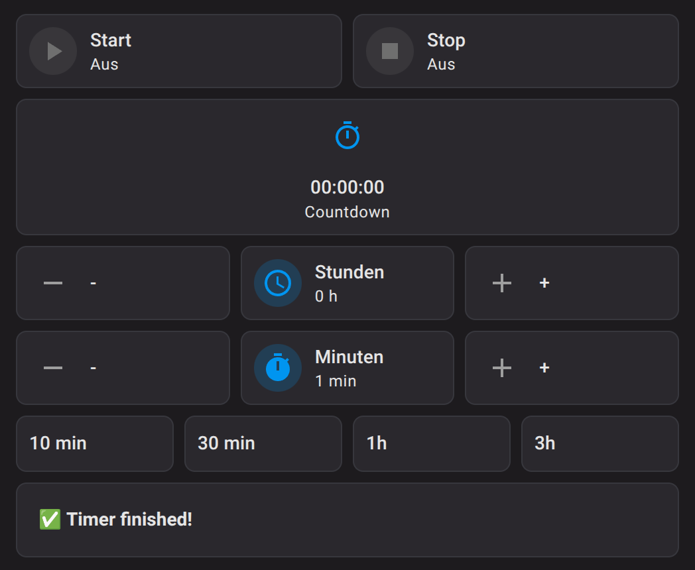
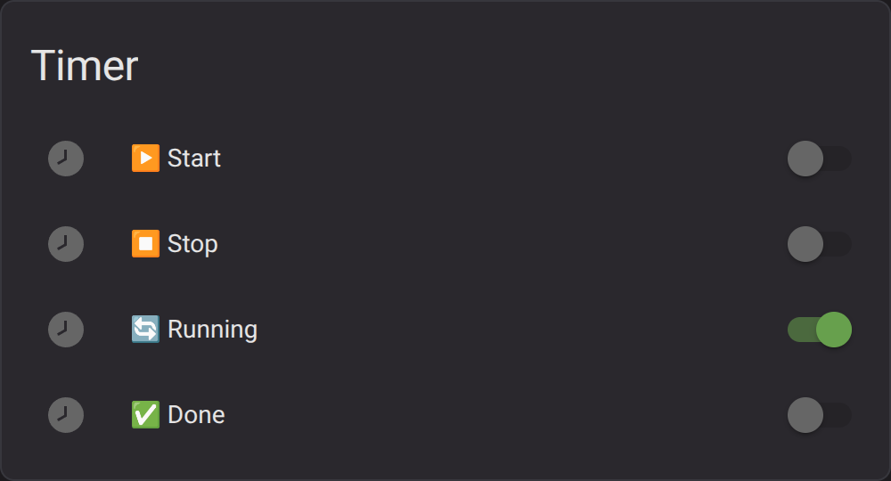
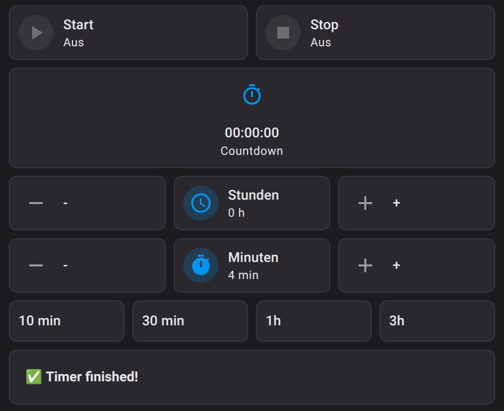

# ⏱️ Ultimate Timer V4 (Countdown + stabile Basis)

[](https://my.home-assistant.io/redirect/blueprint_import/?blueprint_url=https://raw.githubusercontent.com/rockbaer2007/ha-ultimate-timer-v4/main/blueprints/automation/ultimate_timer_v4.yaml)


🇬🇧 [English Version](README.md)

> Erweiterter Timer Blueprint für Home Assistant mit integriertem Countdown und stabiler Kernlogik.

---

## 🚀 Features

- ⏱️ Timer im Format `hh:mm:ss`  
- ▶️ Start-Trigger (Taster)  
- ⏹️ zuverlässiger STOP  
- 📡 Running Status  
- 🎯 DONE bleibt aktiv bis Reset  
- 🌙 täglicher Reset  
- 🔁 Multi-Instance fähig  
- 🛡️ keine Race Conditions  
- ⏳ **integrierter Countdown (NEU in V4)**  

---

## 🔄 Upgrade von V3

### V3 → V4

- Countdown hinzugefügt  
- Startzeit + Dauer Speicherung  
- neue Architektur (Logik + Anzeige getrennt)  

👉 V3 bleibt stabil – V4 ist die Weiterentwicklung

---

## 📦 Installation

### Manuell

```
config/blueprints/automation/
```

---

### Direkt importieren

[](https://my.home-assistant.io/redirect/blueprint_import/?blueprint_url=https://raw.githubusercontent.com/rockbaer2007/ha-ultimate-timer-v4/main/blueprints/automation/ultimate_timer_v4.yaml)

---

## ⚙️ Konfiguration

| Feld | Beschreibung |
|------|------------|
| Start | Timer starten |
| Stop | Timer stoppen |
| Dauer | hh:mm:ss |
| Running | Aktiv |
| Done | Fertig |
| Start Time Helper | speichert Startzeit |
| Duration Helper | speichert Dauer |
| Reset | täglicher Reset |

---


---

## ⚙️ Benötigte Helper

```yaml
input_boolean:
  timer_start:
  timer_stop:
  timer_running:
  timer_done:

input_datetime:
  timer_start_time:
    has_date: false
    has_time: true

input_number:
  timer_duration_sec:
    min: 0
    max: 86400
    step: 1
```

---

## ⏳ Countdown Template Sensor

```yaml
template:
  - sensor:
      - name: "Timer Countdown"
        icon: mdi:timer-outline
        state: >
          
          

          
            {% set start_ts = strptime(start, '%H:%M:%S') %}
            

            

            
            

            {{ '%02d:%02d:%02d' | format(r//3600, (r%3600)//60, r%60) }}
          
            00:00:00
          
```

## 🧠 Funktionsweise

1. Start → Timer läuft  
2. Running → EIN  
3. Countdown startet automatisch  
4. Stop → sofort AUS  
5. Ablauf → Done = EIN  
6. Reset → alles AUS  

---

## 🎥 Demo


---

## 📸 Blueprint Konfiguration


---

## 📸 Vorschau

| Idle | Running | Done |
|------|--------|------|
|  |  |  |

---

## 💡 Einsatz

- Teich / Pool Pumpen  
- Bewässerung  
- Watchdog  
- Verzögerungen  
- Countdown Anzeige  

---

## 📜 Lizenz

MIT Lizenz

---

## ⭐ Support

Wenn dir das Projekt gefällt, gib ihm ein ⭐
