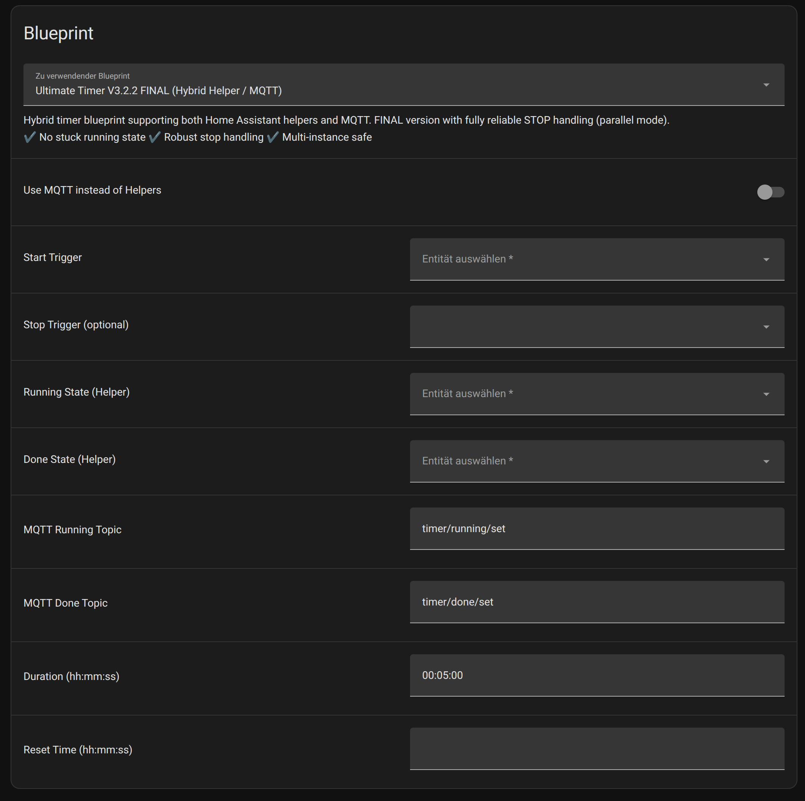
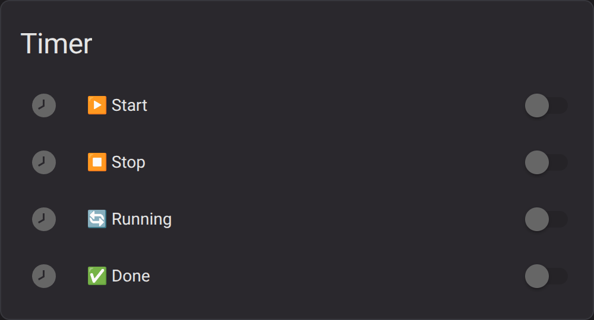
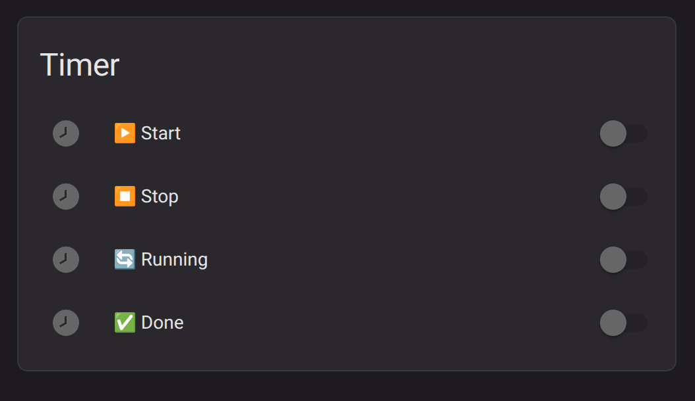
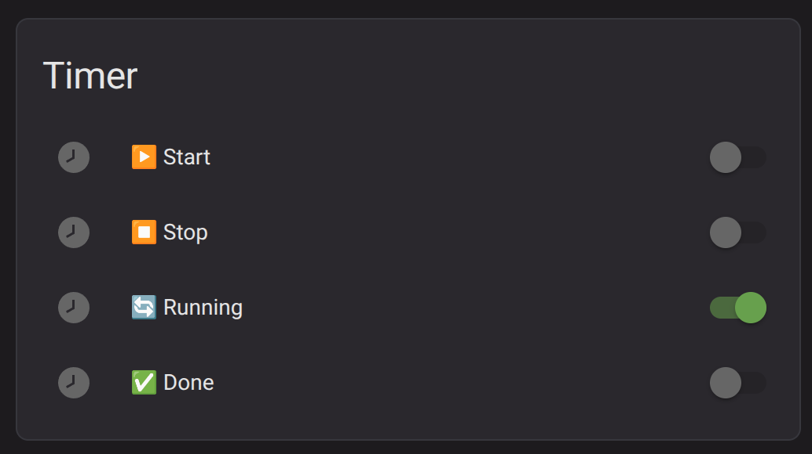
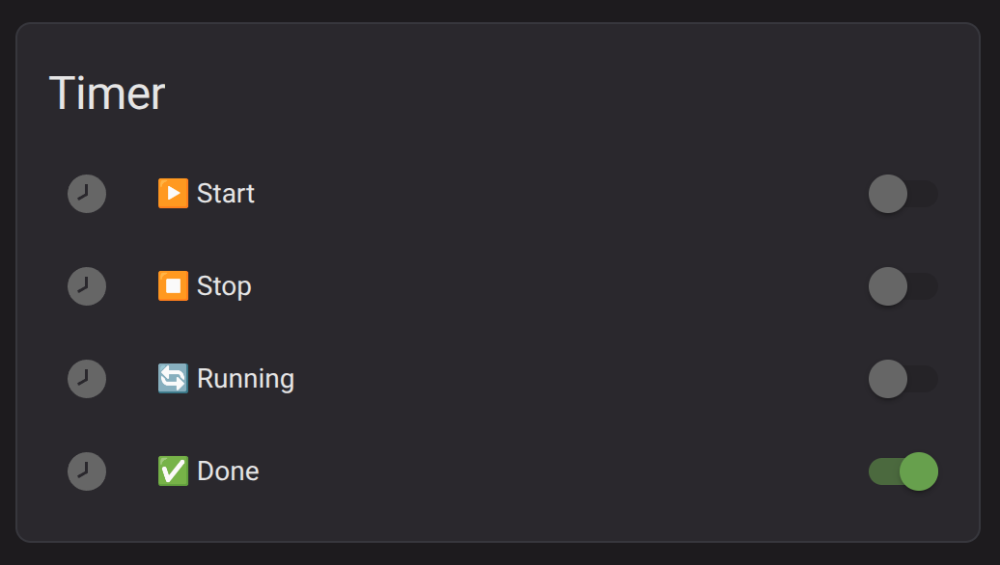
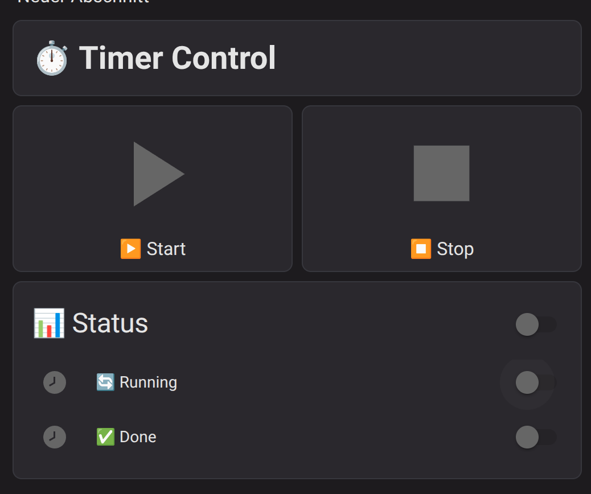
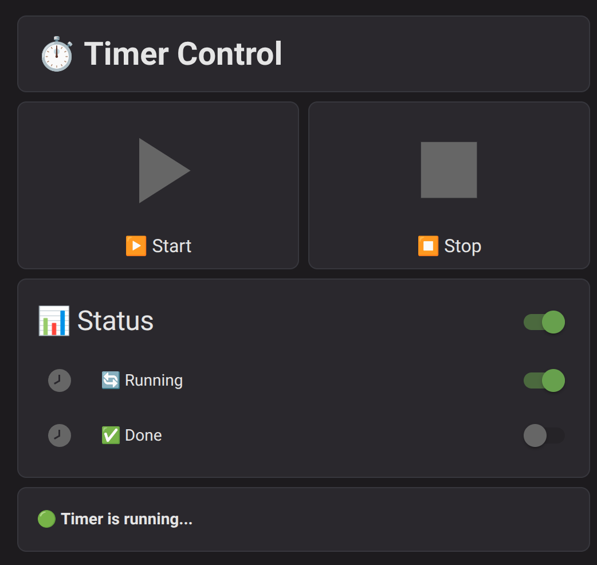
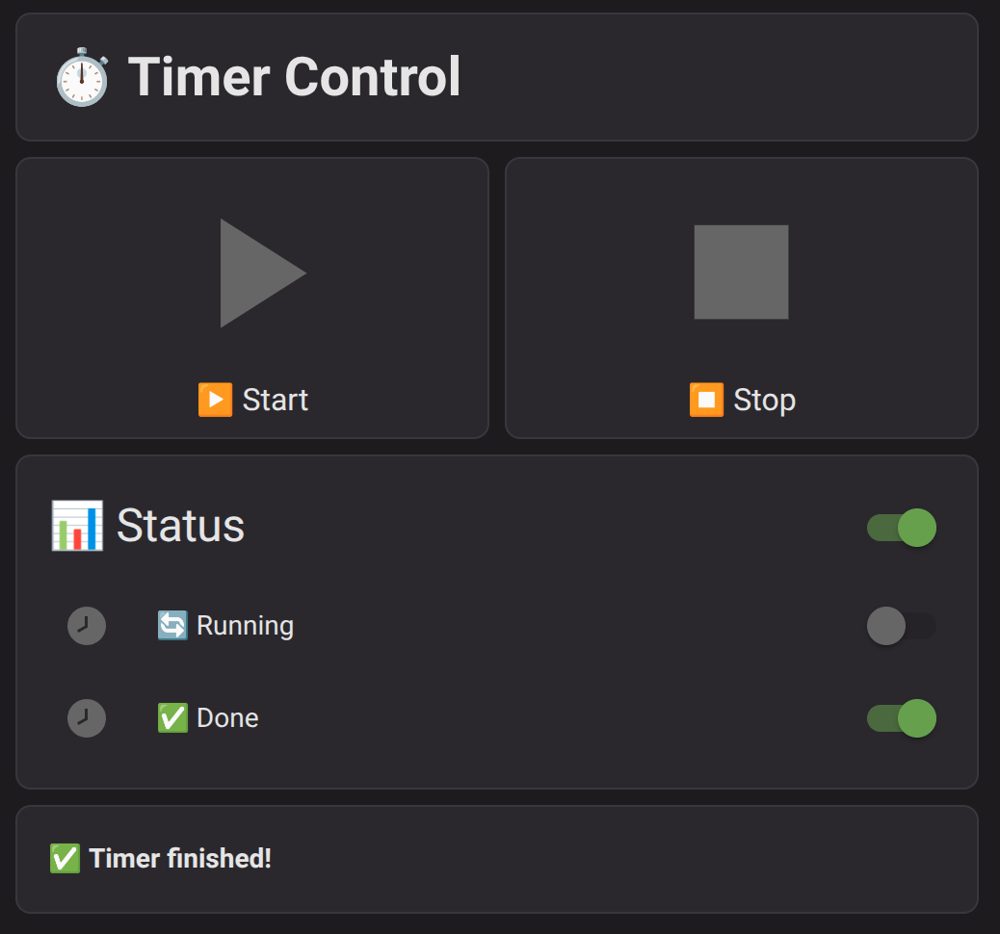

# ⏱️ Ultimate Timer V3.2.4 FINAL CLEAN

[](https://my.home-assistant.io/redirect/blueprint_import/?blueprint_url=https://raw.githubusercontent.com/rockbaer2007/ha-ultimate-timer-blueprint/main/blueprints/automation/ultimate_timer_v3_2_4.yaml)


🇬🇧 [English Version](README.md)

> Leistungsstarker Hybrid-Timer für Home Assistant mit zuverlässiger STOP-Logik, dauerhaftem DONE Status und MQTT Unterstützung.

---

## 🚀 Features

- ⏱️ Timer im Format `hh:mm:ss`  
- ▶️ Start-Trigger (Taster)  
- ⏹️ STOP funktioniert zuverlässig  
- 📡 Running Status  
- 🎯 DONE bleibt aktiv bis Reset  
- 🌙 täglicher Reset  
- 🔁 Multi-Instance fähig  
- 🔀 Helper oder MQTT  
- 🛡️ keine Race Conditions  

---

## 🔄 Update Hinweis

### V3.2 → V3.2.4 FINAL CLEAN

- RUNNING Problem behoben  
- STOP stabilisiert  
- DONE bleibt jetzt aktiv  

👉 Update wird empfohlen

---

## 📦 Installation

### Manuell

```
config/blueprints/automation/
```

---

### Direkt importieren

[](https://my.home-assistant.io/redirect/blueprint_import/?blueprint_url=https://raw.githubusercontent.com/rockbaer2007/ha-ultimate-timer-blueprint/main/blueprints/automation/ultimate_timer_v3_2_4.yaml)

---

## ⚙️ Konfiguration

| Feld | Beschreibung |
|------|------------|
| Start | Timer starten |
| Stop | Timer stoppen |
| Dauer | hh:mm:ss |
| Running | Aktiv |
| Done | Fertig |
| Reset | täglich |

---

## 🧠 Funktionsweise

1. Start → Timer läuft  
2. Running → EIN  
3. Stop → sofort AUS  
4. Ablauf → Done = EIN  
5. Reset → alles AUS  

---
## 📸 Blueprint Configuration



## 🎥 Demo



## 📸 Vorschau
docs/preview.png

| Idle | Running | Done |
|------|--------|------|
|  |  |  |
|  |  |  |

---

## 💡 Einsatz

- Teich / Pool Pumpen  
- Bewässerung  
- Watchdog  
- Verzögerungen  

---

## 📜 Lizenz

MIT Lizenz

---

## ⭐ Support

Wenn dir das Projekt gefällt, gib ihm ein ⭐
